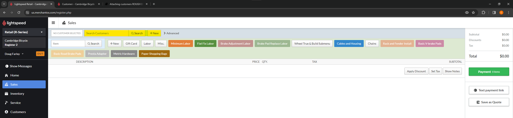
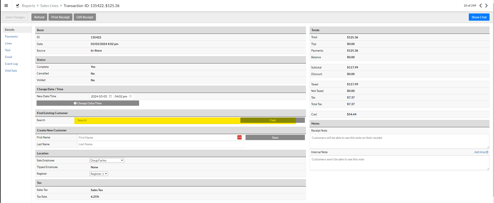

# Attaching customer accounts

### Attach a customer to a sale
From the checkout window, you can either create a new customer account or search for an existing customer account using their name or phone number.

### Attach a customer to a receipt
If you've already completed a sale and want to attach a customer's account to that transaction, you'll first need to get to that transaction. The easiest way is usually from a report. From the Sales Lines report, click on the matching ID for the transaction that you're looking for. If you're trying to find a transaction that you just finished it may be easier to do it from the Payments Received report, which you can order chronologically, and click on the matching id in the Sale column. 
This will open up the transaction record, in the middle of this screen you can search for a customer or create a new customer account.

