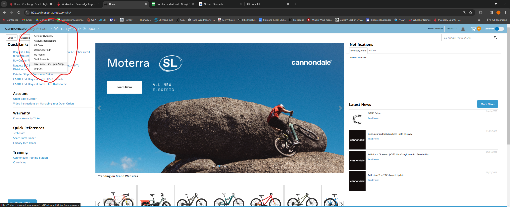

# Online orders
### Online order basics
We fulfill online order for a number of the brands that we're dealers for, each of which has it's own process. We don't get paid for these orders if they're not closed out properly! 

There's usually a workorder attached to this customer, make sure it gets closed out and rung up as well(even though it's likely for $0). We want to treat these customers like someone buying a bike from us, so make sure you check in with them to see if they need anything else - the usual P&A like lights/locks/helmets, fit adjustments, etc. Notably - we don't offer a free tune up or place our shop sticker on bikes bought online.  

### Shipearly
Shipearly is a 3rd party that facilitates b2c sales. They require a verification code on pickup. Currently they're used by Marin, Linus, and Dahon for their online sales. 

Goto shipearlyapp.com and login. You'll need to find the customer's name - it's usually on the dashboard that pops up when you log in. If not, you can search through older orders by clicking on 'Consumer Orders' in the menu on the left. 

Scroll down, there will be a large green 'Enter Verification Code' button. The customer will have been emailed their verification code.

### Cannondale click to collect

Goto Cannondale's b2b website at b2b.cyclingsportsgroup.com and login. 
Click 'My Account' in the upper left, and then 'Buy Online, Pick up in shop'. 

Find the customer's name in the list, and click on the order number.

Select the check-box next to the item being picked up, and click on 'Picked Up'. 

### Tokyobike
Tokyobike will occasionally send us a bike to build. There's no extra steps in the pick-up process, it just should be noted that Tokyobike customers pay full price for the assembly of the bike. 