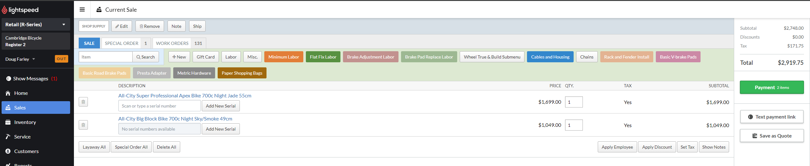

# Bike sales

### Checkout procedure
Bike sales have a few quirks that make them different from regular sales. We want to [attach a customer](\attach) to every bike sale, with their first and last name and phone number.

All of our bikes are serialized items in Lightspeed, so it will prompt you to enter the serial number and won't let you finish the sale without it. The serial number *should* be both saved in Lightspeed and written down on the price tag for the bike. If not, grab it off the bottom bracket shell.

If Lightspeed doesn't prompt you for the serial, it was likely imported or created incorrectly. If possible, open up the [item card](\itemcard), change the item type to 'Serialized', and enter the serial number before proceeding.

You can select the serial number by clicking on the white search field labeled 'Scan or type a serial number'. If your serial is not on the list or there are no serial numbers entered for that bike (happens occasionally when bikes are received in a rush) you can add the serial yourself. 

If a bike that's sold isn't leaving the shop within a few hours (usually because we're installing quite a few accessories, the customer isn't ready to take it home, or it needs to be [special ordered](\specorder)), we prefer to not fully close out the sale and instead take the full payment as a [deposit](\deposit) on a [workorder](\workorder). This makes it significantly easier to keep track of until it leaves the shop.

If the customer is taking the bike immediately, you can finish the sale like any other and hand the bike over to the mechanics for an out-the-door check.

### Out the door check
We always do a final mechanical check on a bike after we sell it before it leaves the shop, this is usually (but not always) when we install the accessories that the customer has picked out. It usually takes a mechanic about 10 minutes in a best case scenario.  It's important to check in with the service writer about when they can accommodate the work - by their nature the out-the-door process is last minute. Be sure to mention all the accessories that are being installed - they can add a significant amount of time. 

If the OTD and installs work won't be done on the same day, it's helpful to create a work order to keep everything straight forward for the mechanics.

### Freebies and discounts

If a customer is buying a new bike and at least 5 accessories (anything else in the store besides another bike, essentially), we offer a 10% discount on all those accessories(Just the accessories, not the bike or any labor). 
For all new bikes we sell, we offer 1 free tune-up within the first year of purchase. We usually recommend that customers come in after 6 months if the bike is being used regularly.