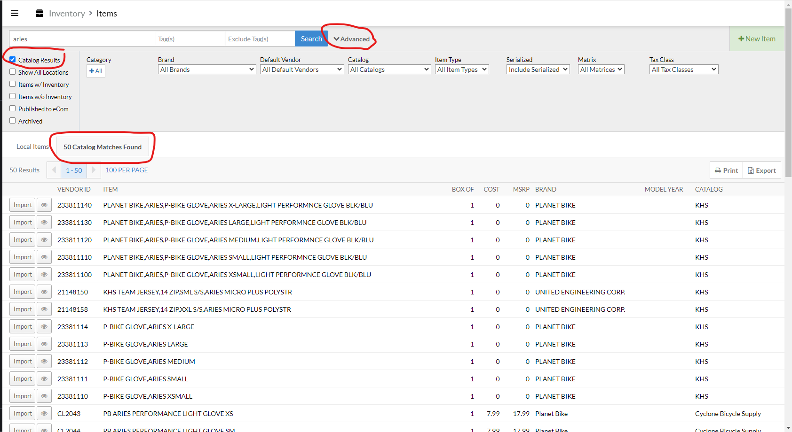
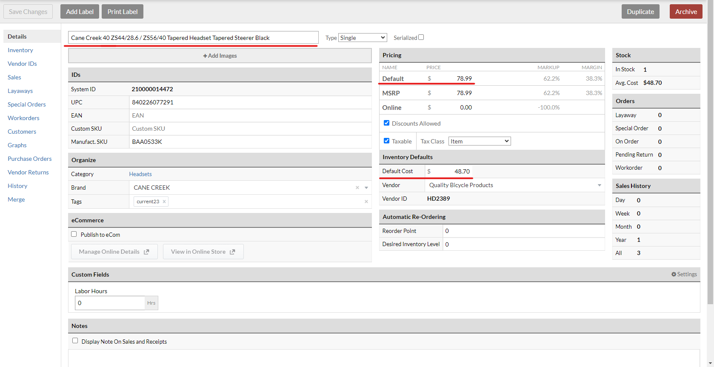
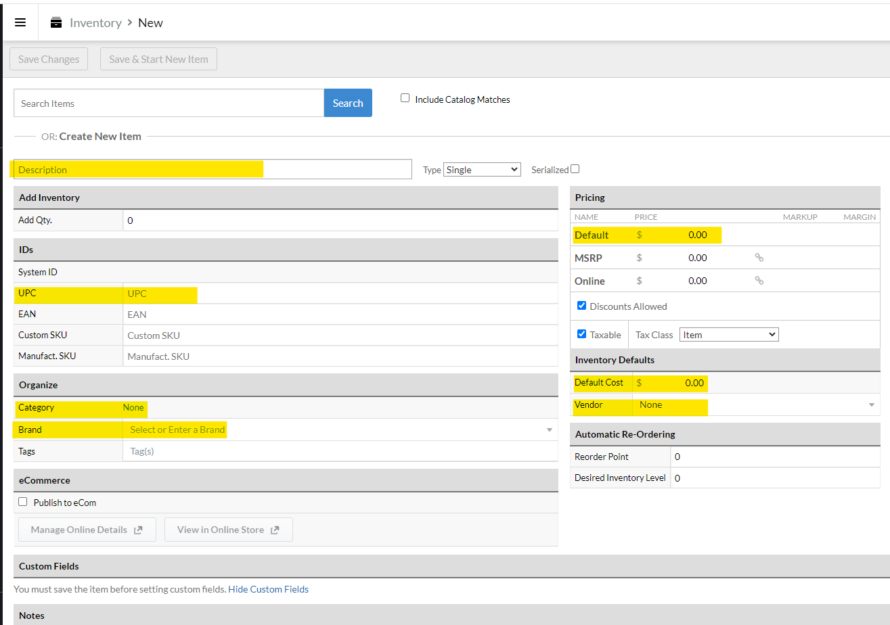
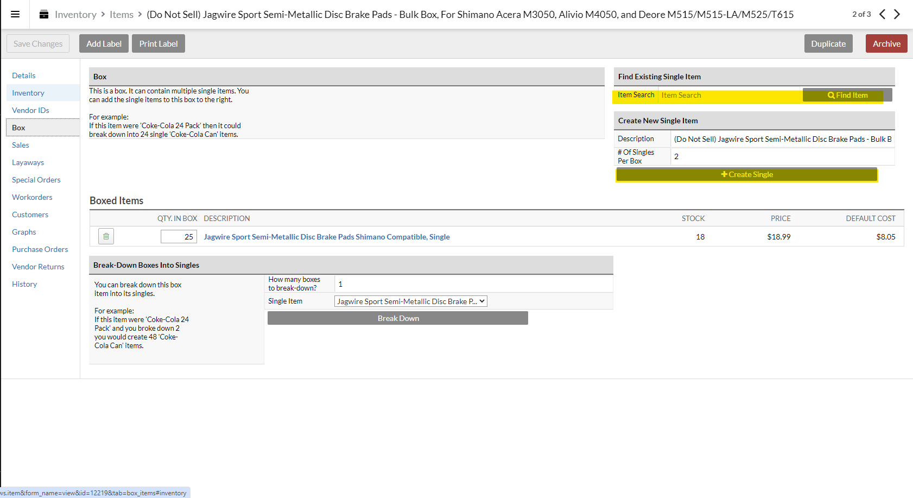
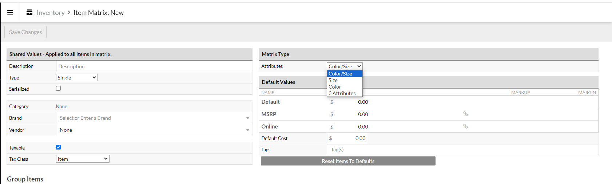
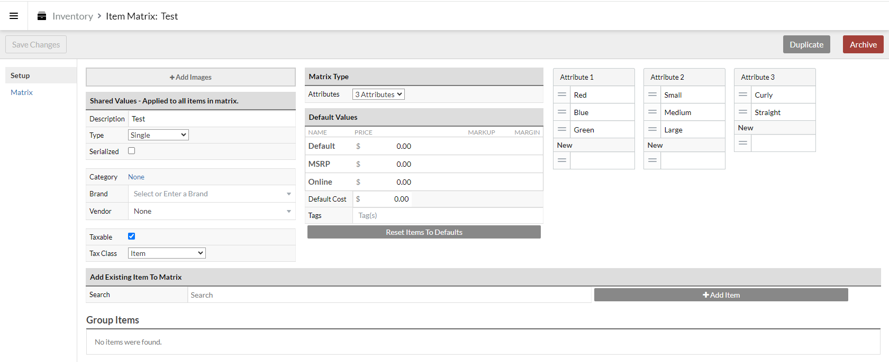

### Best practices
All new bikes that we sell have to have the 'Serialized' button checked on their item card! 
The description should include the brand name, item name, and any descriptors (like size or color if it comes in multiple variations). Only 45 characters will print out on the price tag, so be sure that important things (like a bike's size) aren't in that section. It can be helpful to look at similar items, especially from the same manufacturer, to get an idea of how to name an item. Capitalize appropriately!  

### Importing item cards from a Catalog
When you need to import an item from a vendor's catalog, you'll generally be doing it from the search field of a sale, work order, or purchase order. The easiest way to find the *exact* item you're looking for is to search for the item's UPC, a manufacturer's SKU, or a vendor's item code. You will need to click the 'Advanced' drop-down right next to the search button and make sure that the 'Catalog results' button is checked.

The search results will show up in two different tabs. The left tab will show you matching results already in our inventory (if any) and the right tab will be all matching results from all our vendor catalogs.

You want to make sure that you're selecting the right item, from the right vendor. The vendor you select should usually be the name of the vendor we order from. It gets confusing, as some companies have obsolete catalogs available through Lightspeed or the product is carried by many distributors. For example, searches for a Cane Creek headset product will return 10 results, all for the same product. 
Usually the correct answer for what catalog to pick is QBP, J&B, or the manufacturer's name. 

   

Once you know which item to import, hit the 'Import' button on the far left of that row. It should open up the item card for the new item. Most of the fields should auto-fill, but you'll need to set the Category nearly every time. Verify that the cost (from our distributor) is accurate, as well as the 'Default Price' and the name (Make it readable and match as close as possible to other)

### Creating item cards from scratch
You'll very rarely create item cards from scratch, but occasionally it'll be necessary if an item isn't in any vendor catalogs and there isn't a similar item to duplicate. 
Go to 'Inventory' from the main Lightspeed menu, and click on 'New Item'. A blank item card will be created. At a minimum, we want to have a description, UPC if there is a barcode on the item, a category, brand, our cost and the price we'll sell it at. The description should include the brand name, item name, and any descriptors (like size or color if it comes in multiple variations). Only 45 characters will print out on the price tag, so be sure that important things (like a bike's size) aren't in that section. It can be helpful to look at similar items, especially from the same manufacturer, to get an idea of how to name an item. Capitalize appropriately!  

### Creating a box assembly
When we order bulk products that we sell in smaller units, we create two items for that. The 'box' item will be the one that shows up in vendor catalogs and our purchase orders. The single item will be the one that gets sold. Import the box item as normal, add '(Do not sell)' to the beginning of the description, and change the type to 'Box'. Make sure that the default price is not set to $0, we prefer something outrageously high so that this item doesn't get rung up on accident and screw up the inventory. We generally remove the UPC and EAN from the box item, so that we can use the barcode on the bulk box to ring up an item. Hit 'Save Changes', and then go to the 'Box' section on the left side of the screen.
If the item that we'll be selling singles of has already been created, you can search for it on the right hand side. Otherwise, underneath that it will prompt you to create an item and allow you to edit the description and the number of items per box. 

### Creating a Matrix 
Goto inventory
New Matrix, upper right in green
You'll be prompted to enter all the shared values, cost, and price. We want all the fields filled out on this page.
The attributes drop down will allow you to select the types of attributes that will differentiate the items in the matrix.
 
After you hit Save changes for the first time, the attributes fields will populate and you can start filling them in. 

### Creating a new item by duplicating
If a new item needs to be added that shares *most* characteristics of another item but isn't available from a vendors' catalog and isn't appropriate for a matrix type item, you can duplicate an item. From an item card, hit the 'Duplicate' button in the top right corner. That will create an item with all of the same characteristics as the original, except it will remove the UPC, SKUs, and Vendor IDs from the new item. The name will also have 'Copy of' added to the old name. 