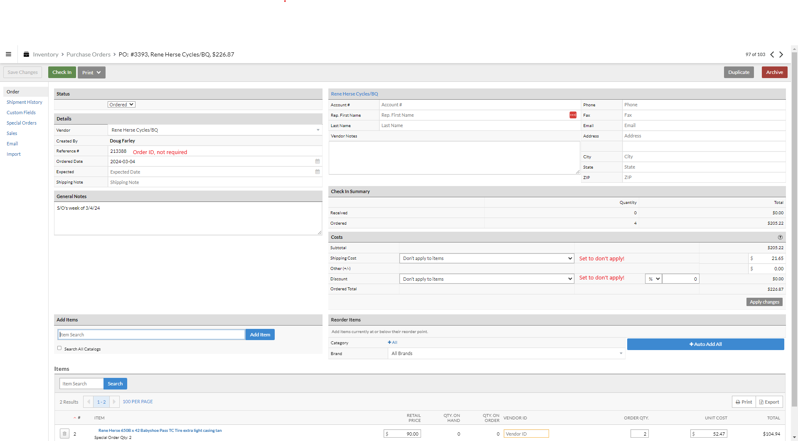
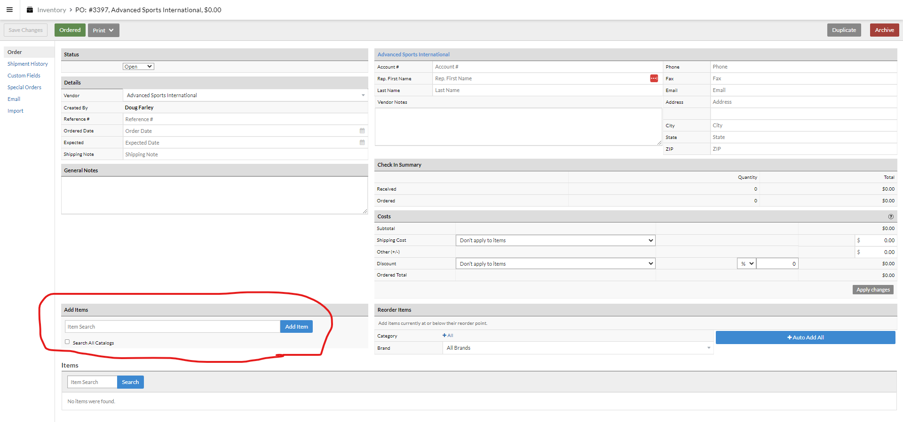
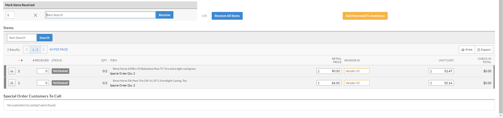
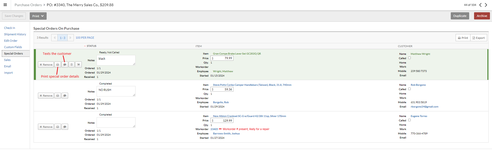

# Receiving and Purchase Orders

### General notes

Click Inventory on the main Lightspeed menu. You can create a new purchase order by hitting 'New Order' or 'Purchase Orders' and then '+New Purchase Order' in the upper right.

Select the Vendor - vendor names don't always line up with the company name that you're expecting, either check other recent purchase orders or ask someone if you're not certain which vendor to select.
Vendor is the only field that's absolutely necessary to select. 

The reference # is usually used for the order number on the packing slip.

Ordered date will auto-fill the date that the purchase order was created, change it to the date the order was placed.

General notes are where we put the bulk of extra info. The first line of of general notes are visible on the main PO screen, if the PO is only special orders we want to leave a note to that effect first. 

We'll often split large orders into several purchase orders - for example our regularly weekly orders with QBP and J&B will be quite large, so on the day we place the order we'll create a PO for all the Special Orders for customers and then another order for each shipment when it arrives. 

In the 'Costs' section, the two dropdown menus need to be set to 'Don't apply to items'. If the Discount field isn't set properly, you won't be able to edit the item costs while receiving. If we paid for the shipping, we like to enter it here as well.

### Receiving a shipment

When a shipment arrives and is ready to be received, first check to see if a purchase order has already been created for it.  

You'll first want to check the items against the packing slip to make sure that we received everything we ordered.

Create a new purchase order if one hasn't been created already. The PO will need to be set to 'Open' or 'Ordered' in order to add items and edit quantities. 

If creating a new purchase order, you'll add the items to the PO one by one in the 'Add Items' field. You can search by the item name, vendor IDs, or UPCs. We generally use a barcode scanner or the vendor IDs from of the packing slip. 

As you go through the packing list: check that the cost of the item in Lightspeed matches the packing slip, the quantity received is correct, and that the vendorID field is filled in.

Once you've entered all the items in the shipment or if the PO was already created, change the status of the PO to 'Check In'. If you've already checked that the PO exactly matches the cost and quantity of what we received, you can hit 'Receive all items'. Otherwise, go through it line by line and set the correct quantity that we received as well as the actual cost displayed on the packing slip (or the distributors b2b site if there is no packing slip).

Once you're done hit 'Add received to inventory', which is the step that updates our inventory. 

Bikes require that we record the serial number before we enter it into inventory. Nearly all of our manufacturers print the serial number of the bike on its box. A few brands do not, which necessitates pulling the bike out of the bike, recording the serial number, **and sealing it back up**. 

If there are special orders on this PO, there are a few more steps below. Otherwise, if everything on the PO has been received and added to inventory, change the state to 'Finished'. If there are still items on the PO that haven't arrived yet, leave it in the 'Check In' state.

### Receiving special orders

There are a few extra steps when you create a PO that include a special order or receive items that are a special order.

While creating a PO, you'll want to click on the 'Special Orders' field on the left side of the screen. This will bring up all of the Special Orders (if any) already on this PO at the top, as well as all of the special orders not currently on a purchase order below that. They'll be color coded - Red for not ordered/added to a PO, Orange once it has been added to a PO, or Green when it has been fully received. If the PO includes the same item for stock and for a special order, you can edit the quantity if necessary on the main 'Order' screen of the PO.

You'll receive the special order items like any other item in the main order window. Once that's done, click on 'Special Orders' on the left side of the screen.

The special order will get a paper printout attached to it. If it's a item that a customer will simply come and pick up, you can click on the print icon. You can click the speech bubble icon to automatically send a text to the customer that their special order is ready. Alternatively, call them(if you need to do more than just notify them, like ask a question or something) or send an email (if we have that but not a phone number). If a customer has ordered more than one item and they'll be arriving around the same time, we generally wait until everything has arrived before notifying them. Once you've reached out, click on the checkbox next to 'Called' to mark that they've been contacted.

If the item is for a repair, there should be a work order number, click on that link and print out a copy of the work order. 

For items that are attached to work orders, you'll need to check to see if any further steps are necessary. If all of the parts are now in the shop, the workorder status should be set to 'Open' or 'Appointment' as appropriate. Occasionally the customer will need to be notified that the parts have arrived so that they can setup an appointment to get them install - this is best handled by the service writer for the day, hand it off to them unless you feel confident in your ability to do that. If the repair is scheduled for today or a prior day, give the service writer a paper copy of the workorder and let them know that the parts are here and the repair needs to be scheduled.

Once the special order is tagged, it needs to be put away. Special orders for repairs go in the yellow bins on the bakers racks downstairs, organized by the date that the repair is scheduled for (there's an overflow bin for repairs with uncertain dates). Other special orders go in the clear bins just past the receiving desk, organized by the customer's first name. Try to group special orders for the same person together so that they're easier to find. If a repair has lots of special order parts that will potentially overfill the yellow bins, grab a cardboard box to use instead and staple a copy of the workorder or special order slips to it.
