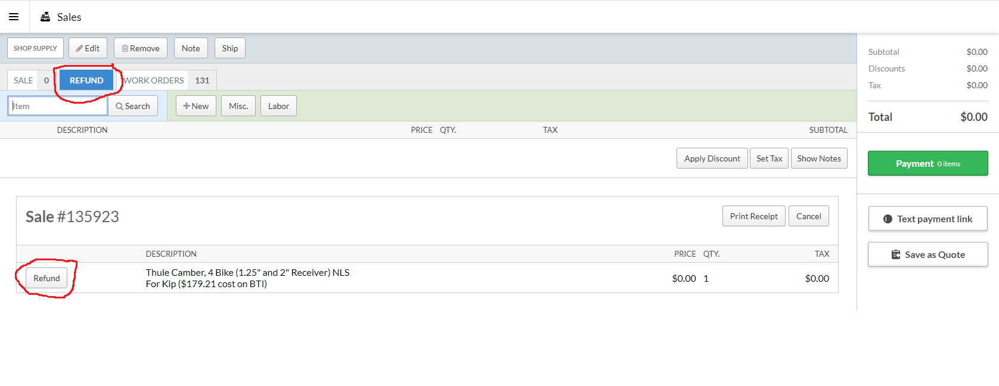
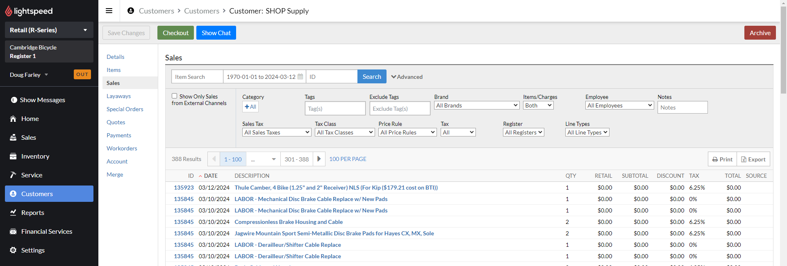

# Returns
### Return policy
All bicycle sales, safety items (such as helmets), and special orders are final.
Deposits are non-refundable.
Labor is non-refundable

All other unopened and unused items may be returned for a refund within seven days of purchase. Items must be accompanied by the sales receipt. New items may also be returned for store credit within one month. No returns on used parts.

### How to process a return
Returns are always handled by a keyholder or manager - most employees' Lightspeed accounts won't allow them to process returns. 
With a receipt in hand, the easiest way to handle a return is to start a new sale and then scan the barcode at the bottom of the receipt

It should automatically bring up the return tab and customer's account (if one exists and is attached to the sale). Click the 'Refund' button next to the item(s) that are being returned. If the customer is purchasing anything else, click on the 'Sale' tab to add other items to the transaction. 

Proceed to the payment screen. If the customer has money going back to them, select the original payment type. For credit cards, hit "Credit/Debit" on the payment field and then there *should* be a button that displays the type of card and last few digits. If that's not there, you may need to have the customer re-insert the credit/debit card into the reader. 

Returns after 7 days should be returned to a customer's account as a store credit.   

Finish the sale and let the customer know that they should receive a refund as soon as their bank/CC company processes it.

### Finding a receipt 

If a customer didn't take or lost their receipt, there are a handful of different ways to track it down. If they have a customer account that's already created, pull that up by clicking on 'Customers' on the main menu, and then searching for their name or phone number. Once in their account page, click on 'Sales' in the submenu. If you can find the item you're looking for, click on the corresponding link in the ID column, and then the 'Refund' button at the top of the following page. If the 'Refund' button doesn't appear on the transaction page, you're usually not logged into a Lightspeed profile that has permissions to process returns.  

If the customer doesn't have a receipt and the sale wasn't attached to their profile, the best way to track down receipts is usually in the 'Reports' section. You'll need to get some additional information from the customer - Date of purchase and the total amount of the transaction are the most helpful, and the easiest to find if the customer paid with a credit card. If they didn't pay with a card, it can occasionally be helpful to know if they purchased anything else at the same time. 